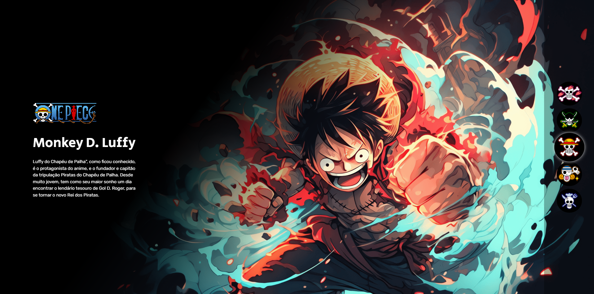
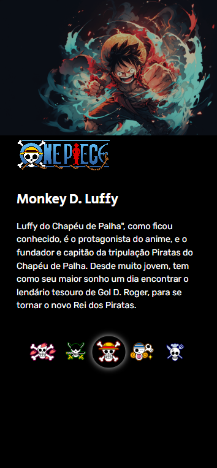

## Índice

- [Visão geral](#visão-geral)
- [Captura de tela](#captura-de-tela)
- [Links](#links)
- [Meu processo](#meu-processo)
- [Criado com](#criado-com)
- [O que aprendi](#o-que-aprendi)
- [Desenvolvimento contínuo](#desenvolvimento-continuo)
- [Autor](#autor)
- [Agradecimentos](#agradecimentos)

## Visão geral

Essa página foi criada duarante a Semana do Zero ao Programador Contratado, evento realizado pelo Dev em Dobro, onde foi feito o meu primeiro site usando HTML, CSS e JavaScript.

### Captura de tela

### Links

- URL do site ativo: [https://mariocarlaibe.github.io/projeto-one-piece/](https://mariocarlaibe.github.io/projeto-one-piece/)

## Meu processo

### Criado com

- HTML
- CSS
- Flexbox
- JavaScript
- Upscaling IA

### O que aprendi

Essa foi a base para tudo o que eu sei até agora, foi o início da minha paixão em programação. Considero esse projeto um marco na minha vida.

### Desenvolvimento contínuo

## Autor

- Site - [Mário Carlaibe](https://github.com/MarioCarlaibe)
- Mentor de front-end - [@MarioCarlaibe](https://www.frontendmentor.io/profile/MarioCarlaibe)

## Agradecimentos

Agradeço ao DevQuest pelo conhecimento adquirido e as instruções fornecidas.